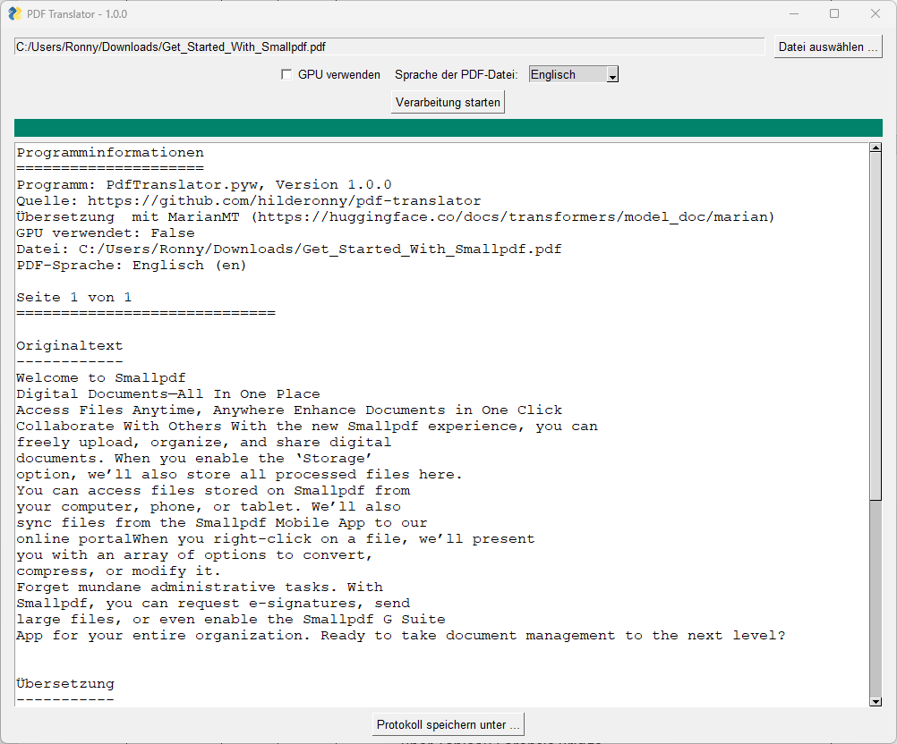

# pdf-translator

Mit diesem Tool können PDF-Dokumente übersetzt werden.

[Download](https://github.com/hilderonny/pdf-translator/releases)

## Benutzung

Einfach die neueste ZIP-Datei von [hier](https://github.com/hilderonny/pdf-translator/releases) herunterladen, entpacken und die Datei **PdfTranslator.exe** ausführen. Das Programm benötigt keine Installation.

Wenn das Programm läuft, wählt man eine Datei, die darin enthaltene Sprache und startet die Übersetzung.

Bei der ersten Ausführung werden die benötigten KNN-Modelle (je Sprache etwa 1 GB) heruntergeladen.

Nach Abschluss wird im Anwendungsfenster ein Protokoll der Übersetzung angezeigt, welches in einer Textdatei gespeichert werden kann.

## Einrichtung der Entwicklungsumgebung

1. Python mit der Version 3.11.6 mit der Erweiterung "TCL/TK" installiert werden. https://www.python.org/downloads/windows/
1. Repository klonen
1. `pip install -r requirements.txt`
1. Stanza Modelle in Unterverzeichnis `./data/stanza` kopieren
1. MarianMT Modelle in Unterverzeichnis `./data/transformers_cache/hub` kopieren

## Unterstützung neuer Sprachen

Um eine neue Sprache zu unterstützen, muss man im Quellcode die entsprechende Sprache einkommentieren, Zeile 116 (download) einkommentieren und anschließend
ein einfaches PDF-Dokument mit irgendeinem Inhalt (kann auch Dummy-Datei sein) verarbeiten. Dabei muss eine Internetverbindung bestehen.
Bei diesem erstmaligen Verwenden einer Sprache werden automatisch die entsprechenden KNN-Modelle heruntergeladen (1 x Stanza ~ 500 MB, 1 x Marian ~ 500 MB).